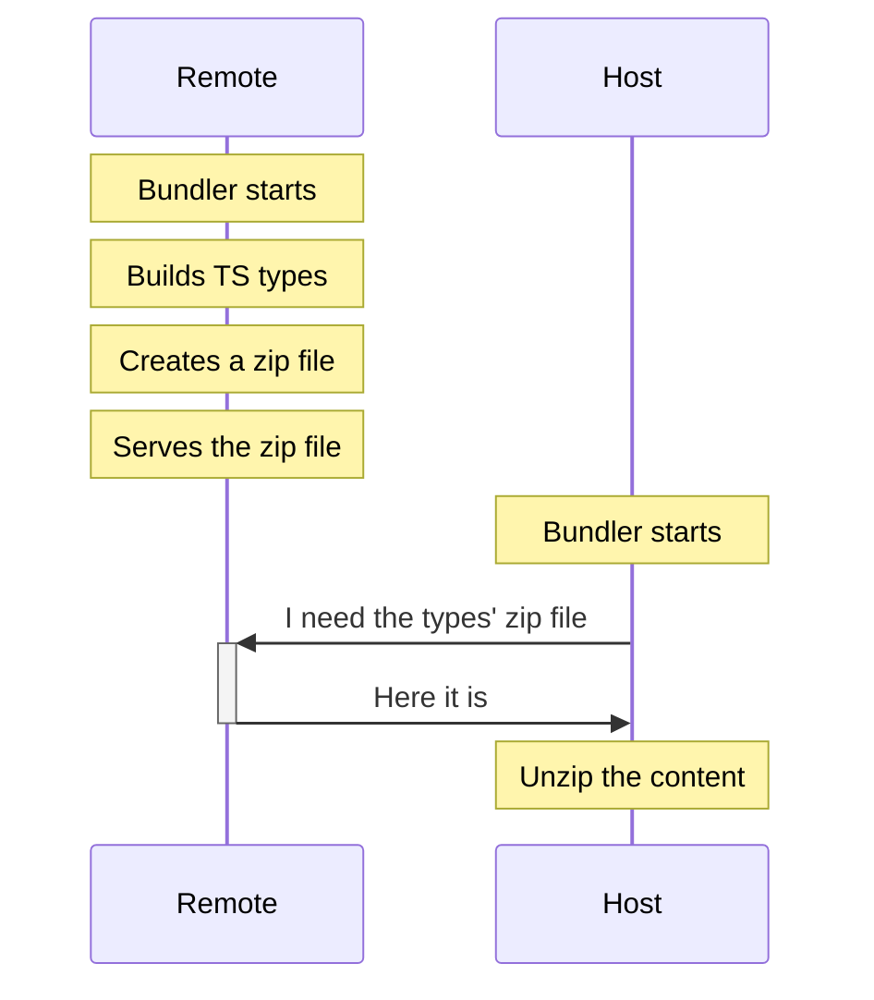

# TypeScript - solution 2 - diagram

<a href="https://github.com/ilteoood/solving-real-world-module-federation-problems" target="_blank" alt="GitHub" class="flex justify-center items-center text-xl slidev-icon-btn opacity-100 !border-none !hover:text-white">
    <carbon-logo-github /> ilteoood/native-federation-typescript
</a>

