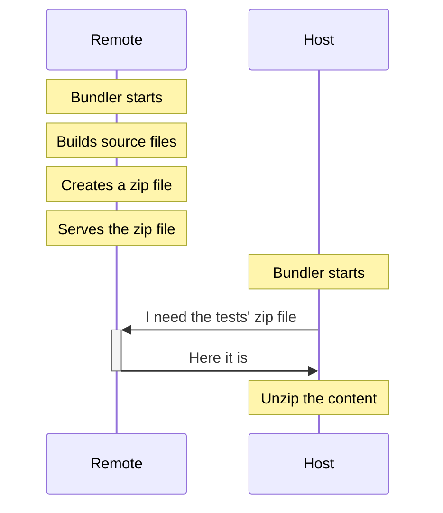

# TypeScript - solution 2 - diagram

<a href="https://github.com/module-federation/universe/tree/main/packages/native-federation-tests" target="_blank" alt="GitHub" class="flex justify-center items-center text-xl slidev-icon-btn opacity-100 !border-none !hover:text-white">
    <carbon-logo-github /> module-federation/native-federation-tests
</a>

